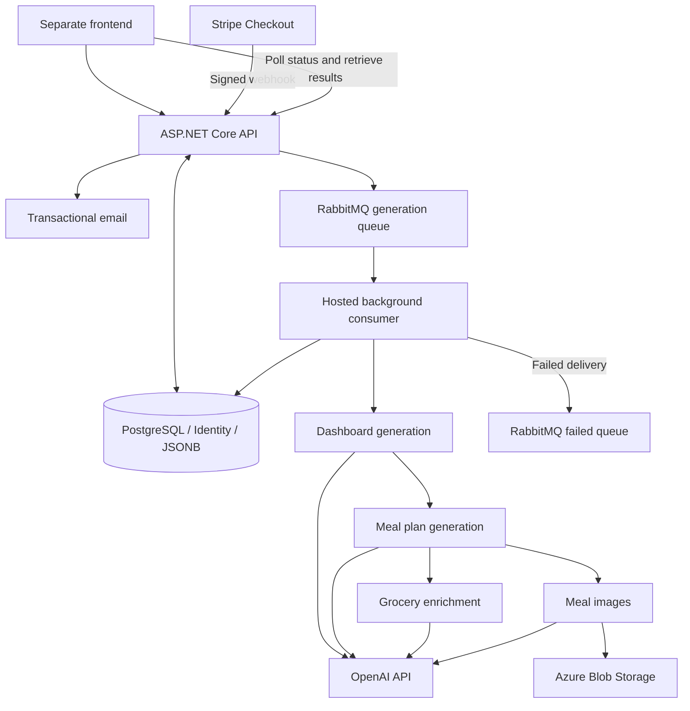

# MealGenius

MealGenius is a personalized meal-planning product built around an ASP.NET Core backend. It collects nutrition goals and food preferences, runs a multi-stage generation pipeline through RabbitMQ, saves results in PostgreSQL, and stores generated meal images in Azure Blob Storage. A separate frontend consumes its APIs and polls for progress.

## Context and my contribution

I designed and developed the .NET backend in 2023–2024. The frontend implementation and UI/UX were commissioned separately and integrated with my backend. My work covered authentication, API endpoints, persistence, background processing, OpenAI orchestration, payment processing, transactional email and Azure deployment integration.

This restoration preserves that application structure. Security boundaries, failure handling, configuration and dependencies have been updated; it is not a newly designed architecture. The original product was deployed, according to the project owner's account. This repository contains deployment configuration, but does not establish whether the old infrastructure is still running.

## Architecture



One deployable web application contains both controllers and the hosted consumer. Controllers use services; those services use EF Core and external integrations. This is a service-oriented application within one process, not a microservice system. RabbitMQ is the broker demonstrated by the code and history; Azure Service Bus is not used.

## Backend stack

| Responsibility | Implementation |
| --- | --- |
| HTTP API | C#, ASP.NET Core 8, controllers, dependency injection |
| Accounts | ASP.NET Core Identity, JWT in an HttpOnly cookie |
| Persistence | EF Core, Npgsql, PostgreSQL, JSONB |
| Background work | RabbitMQ, asynchronous consumer, hosted service |
| Generated content | OpenAI Chat Completions and Images HTTP APIs |
| Images | Azure Blob Storage, ImageSharp JPEG conversion |
| Payments and email | Stripe webhooks, FluentEmail/Mailgun |
| Delivery | GitHub Actions, Azure App Service deployment action |

## How MealGenius works

1. **Onboarding:** `MainAPI.RegisterUser` validates the questionnaire, creates an Identity user, saves input and creates a generation task. An email carries ownership proof.
2. **Account access:** confirmation validates an Identity token. Passwordless users receive a setup token; setting or resetting a password requires a valid token. Login checks the password and lockout rules.
3. **Payment:** the Stripe endpoint validates the webhook signature, paid status, configured amount/currency and registered customer reference/email. It records the paid entitlement.
4. **Enqueue:** a small message identifies the user and task. The HTTP request can finish while generation continues.
5. **Dashboard:** the worker builds nutrition/dashboard content from questionnaire data and persists it.
6. **Meals:** prompts use the input and dashboard to generate the meal plan, persisted as document-like output.
7. **Groceries and images:** these stages run concurrently in separate service scopes. Groceries are enriched against the image catalogue; meal images are generated and uploaded as JPEGs to Blob Storage.
8. **Completion:** required outputs are checked before marking the task `Completed`. Failures mark it `Failed` and route the delivery to the failed queue.
9. **Retrieval:** authenticated, entitled users poll task status/versions and request their dashboard and meal plan. Stored image URLs let the frontend load images separately.

## The asynchronous generation pipeline

Generation involves multiple slow external calls. Keeping it behind a queue avoids holding a controller request open for the whole operation and gives progress a persistent representation.

`ExecuteTaskService` publishes through `RabbitMQService` to `mealgenius.generation.v2`. Messages are persistent and publisher confirms are enabled. `RabbitMQConsumerHostedService` uses an asynchronous callback, manual acknowledgement and prefetch of one. `GenerationJobProcessor` owns orchestration and the final status transition.

Acknowledgement happens after successful processing. Failed work is negatively acknowledged without requeue and dead-lettered to `mealgenius.generation.failed`; shutdown cancellation requeues work. A PostgreSQL advisory lock serializes processing of the same task. Already completed tasks are skipped. Stored stage outputs and image URLs support partial recovery.

This is **at-least-once delivery**, not exactly-once execution. There is no transactional outbox tying database writes to publication. A crash can repeat external work or email. Failed jobs need deliberate investigation and retry; there is no automatic dead-letter replay service. [Architecture details](docs/architecture.md) explain these boundaries.

## AI integration

The interesting part is orchestration, not custom machine learning. Historical prompt templates and services assemble system/user messages from questionnaire data and previous stages. Email is removed from questionnaire JSON before it enters prompts; nutrition preferences and profile details still go to OpenAI.

`OpenAIService` uses a typed `HttpClient`. Configurable defaults are `gpt-4.1-mini` for text/JSON and `gpt-image-2` for images. JSON requests use JSON-object mode; malformed JSON, empty responses and truncated completions fail explicitly. This is not full domain/schema validation, and generated nutritional advice is not independently verified.

Images are returned as base64, decoded, converted to JPEG and uploaded under deterministic task/meal paths. Existing image URLs are retained when a stage is retried.

External requests have bounded attempts (default three), limited concurrency (default three), timeout and cancellation. Transient HTTP/network failures are retried; permanent failures and malformed output are not retried indefinitely. The job deadline defaults to 20 minutes. Current model availability and account permissions must still be checked when configuring an actual deployment; no paid OpenAI call was made during restoration.

## Persistence

`UserDbContext` combines Identity tables with questionnaire inputs, tasks, dashboards, meal plans, grocery/image catalogue data, access-token receipts and processed Stripe event IDs. EF migrations preserve the historical schema evolution; the restoration adds processed-event tracking.

Generated nested content is partly stored as JSON/JSONB rather than decomposed into many relational tables. That matches how complete generated documents are saved and served, while relational IDs retain ownership and task associations. The tradeoff is weaker database enforcement of internal document shape. Version fields allow polling clients to detect updated results.

## Azure and deployment

Azure Blob Storage holds generated images. Create the configured container and arrange read access appropriate for the frontend; the application does not provision infrastructure or change container access policy.

The GitHub Actions workflow restores, builds, tests and publishes the backend. PostgreSQL-backed tests run against an ephemeral CI service. Deployment is an explicit manual workflow option using an Azure App Service name and publish-profile secret in the protected `production` environment. There is no infrastructure-as-code, and this restoration has not deployed anything.

## Security and configuration

**Do not make the original repository public yet.** Historical credentials require manual revocation/rotation. See [required rotation](SECURITY_ROTATION_REQUIRED.md) and the [publication checklist](docs/publication.md).

Configuration comes from standard .NET configuration plus ignored `appsettings.Local.json`, with environment variables taking precedence. Nested environment keys use double underscores. Copy [appsettings.example.json](appsettings.example.json) locally; never commit the populated file. `.env` is used by Docker Compose, not automatically loaded by ASP.NET Core.

| Variable | Purpose |
| --- | --- |
| `MEALGENIUS_CONNECTIONSTRING` | PostgreSQL connection string |
| `JwtConfig__Key` | Random signing secret, at least 32 bytes |
| `JwtConfig__Issuer`, `JwtConfig__Audience` | Token validation |
| `RABBITMQ_HOSTNAME`, `RABBITMQ_PORT` | Broker location |
| `RABBITMQ_USERNAME`, `RABBITMQ_PASSWORD` | Broker credentials |
| `OPENAI_API_KEY` | OpenAI access |
| `Mailgun__Domain`, `Mailgun__ApiKey`, `Mailgun__From` | Transactional mail |
| `AzureStorageConfig__ConnectionString`, `AzureStorageConfig__ContainerName` | Image storage |
| `EndpointSecret` | Stripe webhook signing secret |
| `Stripe__ExpectedAmountTotal`, `Stripe__Currency` | Expected checkout total in minor units and currency |
| `FRONTEND_URL`, `CONFIRMATION_PAGE_ROUTE` | Allowed frontend origin and email destination route |

Optional overrides include `OpenAI__TextModel`, `OpenAI__JsonModel`, `OpenAI__ImageModel`, `OpenAI__MaxAttempts`, `OpenAI__MaxConcurrency`, `Generation__TimeoutMinutes` and `Messaging__Enabled`. Disabling messaging permits API inspection without a broker; it does not make generation functional.

Cookie authentication is HttpOnly, host-only and SameSite=Lax. Browser mutations must send `X-MealGenius-Client: web`; signed Stripe webhooks are exempt. Production requires HTTPS. The configured frontend/backend topology must be compatible with these cookies. Password changes invalidate old sessions through Identity security-stamp validation. See [API compatibility notes](docs/api.md) before reconnecting an old frontend.

## Running locally

Prerequisites: .NET 8 SDK/runtime, Node.js for repository scans, Docker with a running engine (or your own PostgreSQL and RabbitMQ). External integrations need real, newly rotated credentials. No frontend source is included here.

```powershell
Copy-Item .env.example .env
Copy-Item appsettings.example.json appsettings.Local.json
# Edit both local files. Use matching local database/broker credentials.
# Set a random JWT key and configure the external services you intend to use.
docker compose up -d
dotnet tool restore
dotnet restore MealGeniusBackend.sln
dotnet build MealGeniusBackend.sln
dotnet ef database update --project MealGeniusBackend.csproj
dotnet run --project MealGeniusBackend.csproj --launch-profile MealGeniusBackend
```

The development HTTP profile listens on port 5139; inspect Swagger at `/swagger`. Database migrations are explicit, not automatically applied at startup. Use a new local database first. Stripe Checkout must supply the registered user ID as its client reference and a matching customer email; configure the expected price before testing payment.

```powershell
dotnet test MealGeniusBackend.sln
node scripts/scan-secrets.cjs
node scripts/scan-secrets.cjs --history HEAD
dotnet publish MealGeniusBackend.csproj -c Release -o artifacts/publish
```

For database integration tests, set `MEALGENIUS_TEST_POSTGRES` to a disposable database whose name contains `test`. Without it, those tests are skipped. [Verification](docs/verification.md) distinguishes executed checks from infrastructure-dependent checks.

## Repository structure

| Path | Responsibility |
| --- | --- |
| `Controllers/` | Account, questionnaire, payment, progress and result APIs |
| `Services/Dashboard/` | Dashboard, meal, grocery and image generation stages |
| `Services/RabbitMQ/` | Publication, topology and hosted consumption |
| `Services/Auth/` | Tokens, account lookup and access-token hashing |
| `Services/GenerationJobProcessor.cs` | Task orchestration, recovery and completion |
| `DataAccess/` | EF context/entities and design-time context factory |
| `Models/`, `Mapper/` | Input models and transformations |
| `Migrations/` | Historical schema evolution and new event receipts |
| `PromptFiles/`, `JsonFiles/` | Prompt assets and reference data |
| `EmailTemplate/` | Transactional email HTML |
| `tests/` | Security, generation and PostgreSQL integration tests |
| `scripts/`, `.github/workflows/` | Publication checks and delivery automation |

## Engineering decisions and what I would improve today

The implementation separates long-running generation from HTTP handling, keeps progress in PostgreSQL, and serves image bytes from object storage. These are visible design properties, not claims about undocumented historical motivations. [History notes](docs/history.md) separate the original implementation from restoration work.

With what I know today, I would add a transactional outbox, stronger schemas for AI output, broker-backed fault-injection tests, and clearer operational metrics for failed jobs and external API costs. I would also separate transactional email delivery from payment processing. Those are useful next steps without replacing the application architecture.

## Product visuals

No verified product screenshots or frontend source are included in this backend checkout. Add owned screenshots from the actual application when available; the backend remains the technical focus.

## Current status

The backend builds and focused local tests pass. Full generation and deployment still require configured external services. PostgreSQL integration tests are provided but were skipped locally because the Docker engine was unavailable. Historical nullable warnings remain. Credential rotation and the publication checklist are mandatory before public release; no production-readiness claim is made.
